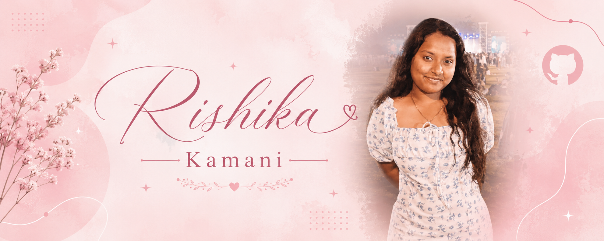

  

  

  <b>Building intelligent systems, reliable software and refined digital experiences.</b>

 

  
  
  
  

 

  
  

 

  

<h2 align="center">A Little About Me</h2>

  Electronics and Communication Engineering student with hands-on experience in
  <b>FPGA design, embedded systems, artificial intelligence, signal processing and software development</b>.

  I enjoy building practical systems where intelligent hardware meets modern software.

  <b>Hyderabad, India</b>&nbsp; • &nbsp;<b>B.Tech ECE, 2023–2027</b>&nbsp; • &nbsp;<b>CGPA: 9.21</b>

  

<h2 align="center">✦ Two Worlds I Build In</h2>

<table align="center" width="100%">
<tr>
<td width="50%" align="center" valign="top">
<h3>Electronics &amp; Intelligent Hardware</h3>

FPGA Design Embedded Systems VHDL and Verilog Signal Processing Raspberry Pi Vivado Design Suite

</td>
<td width="50%" align="center" valign="top">
<h3>Software &amp; AI</h3>

React and Next.js Spring Boot Python and Java REST APIs Artificial Intelligence and LLMs OCR and Voice Interfaces

</td>
</tr>
</table>

  

<h2 align="center">✦ Software Projects</h2>

<table width="100%">
<tr>

<td width="50%" align="center" valign="top">

<h3>✨ SlayIt</h3>

AI-powered habit tracking application with authentication,
streak monitoring and intelligent productivity features.

 

<b>React.js · Spring Boot · REST APIs</b>

  

</td>

<td width="50%" align="center" valign="top">

<h3>🏛️ SevaSetu Telangana</h3>

Multilingual citizen-services platform powered by AI,
OCR, voice assistance and smart service discovery.

 

<b>Next.js · AI · OCR · Voice Assistant</b>

  

</td>

</tr>

<tr>

<td width="50%" align="center" valign="top">

<h3>🏋️ CultFitNeo Gym</h3>

Modern responsive fitness website featuring
programs, trainers and membership information.

 

<b>React.js · HTML · CSS · JavaScript</b>

  

</td>

<td width="50%" align="center" valign="top">

<h3>🪑 Saanvi Furniture</h3>

Premium furniture showcase with elegant layouts,
responsive product pages and clean UI.

 

<b>React.js · HTML · CSS · JavaScript</b>

  

</td>

</tr>

<tr>

<td width="50%" align="center" valign="top">

<h3>🦷 Aarogya Dental Clinic</h3>

Healthcare website with appointment booking,
service information and responsive design.

 

<b>React.js · HTML · CSS · JavaScript</b>

  

</td>

<td width="50%" align="center" valign="top">

<h3>🖼️ Shruthi Museum</h3>

Interactive memory website featuring custom
animations, storytelling and immersive visuals.

 

<b>React.js · HTML · CSS · JavaScript</b>

  

</td>

</tr>

</table>

  

<h2 align="center">✦ Core Engineering Projects</h2>

<table width="100%">

<tr>

<td width="50%" align="center" valign="top">

<h3>🩸 FPGA CNN Accelerator</h3>

FPGA-based CNN architecture for leukemia cell
classification using HDL and Vivado Design Suite.

 

<b>Verilog · FPGA · CNN · RTL Design</b>

</td>

<td width="50%" align="center" valign="top">

<h3>❤️ ECG QRS Detection</h3>

Real-time ECG signal processing system for
accurate QRS complex detection and analysis.

 

<b>MATLAB · DSP · ECG Processing · Signal Analysis</b>

</td>

</tr>

<tr>

<td width="50%" align="center" valign="top">

<h3>🧠 Spiking U-Net</h3>

Neuromorphic speech enhancement using Spiking
Neural Networks and event-driven computation.

 

<b>Python · PyTorch · SNN · Speech Enhancement</b>

</td>

<td width="50%" align="center" valign="top">

<h3>🤖 Anusandhan</h3>

Offline AI companion powered by Raspberry Pi,
local language models and voice interaction.

 

<b>Python · Raspberry Pi · LLMs · Speech AI</b>

</td>

</tr>

</table>

  

  

<h2 align="center">✦ Research &amp; Recognition</h2>

<table align="center" width="100%">
<tr>
<td width="50%" align="center" valign="top">
<h3>Research &amp; Innovation</h3>

Spiking U-Net Research — <b>Under Review</b> ECG QRS Research — <b>Under Review</b> Anusandhan Patent — <b>Application Submitted</b>

</td>
<td width="50%" align="center" valign="top">
<h3>Awards &amp; Achievements</h3>

First Prize — <b>TECHSYNAPSE TECHBRIDGE</b> Third Prize — <b>College Science Expo 2025</b> Patent Application — <b>Anusandhan Offline AI Companion</b>

</td>
</tr>
</table>

  

<h2 align="center">✦ Connect With Me</h2>

 

  
  
  

 

  <i>“The best engineering happens when imagination is supported by disciplined execution.”</i>

  ♡ ───────────────────────────── ♡

