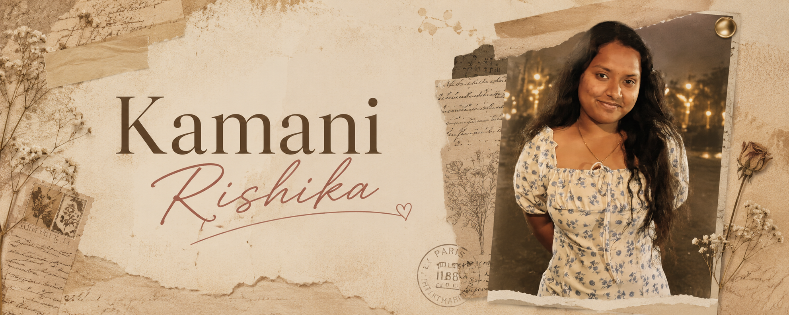

  

  

  
  
  
  

  
  
  

  <i>Building thoughtful technology where electronics, intelligence and software meet.</i>

  ❦ ───────────────────────────────────────── ❦

<h2 align="center">A Little About Me</h2>

I am an Electronics and Communication Engineering student at Anurag University with hands-on experience in
<b>FPGA design, embedded systems, software development, artificial intelligence and signal processing</b>.

I enjoy building practical systems across both hardware and software—from digital logic and intelligent embedded systems
to AI-powered web applications and full-stack products.

<b>Hyderabad, India</b>
&nbsp; • &nbsp;
<b>B.Tech ECE, 2023–2027</b>
&nbsp; • &nbsp;
<b>CGPA: 9.21</b>

  ❦ ───────────────────────────────────────── ❦

<h2 align="center">Two Worlds I Build In</h2>

<table>
  <tr>
    <td width="50%" align="center" valign="top">

<h3>Electronics & Intelligent Hardware</h3>

FPGA Design  
Embedded Systems  
VHDL and Verilog  
Signal Processing  
Digital Electronics  
VLSI Fundamentals  
Raspberry Pi  
Xilinx ZC702  
Vivado Design Suite  

</td>

<td width="50%" align="center" valign="top">

<h3>Software & AI</h3>

React and Next.js  
Spring Boot  
Python and Java  
Full-Stack Development  
REST APIs  
Artificial Intelligence  
Local Language Models  
OCR and Voice Interfaces  
Responsive UI Development  

</td>
  </tr>
</table>

  ❦ ───────────────────────────────────────── ❦

<h2 align="center">Electronics, Embedded Systems & AI Hardware</h2>

<table>
<tr>
<td width="50%" valign="top">

<h3 align="center">FPGA-Based Leukemia Cell Classification</h3>

Designed a CNN-inspired hardware architecture for leukemia-cell classification from digital microscopy images.
Implemented modular convolution, activation, pooling and classification stages using HDL in Vivado.

<b>FPGA · HDL · Vivado · CNN Architecture</b>

</td>

<td width="50%" valign="top">

<h3 align="center">Spiking U-Net for Speech Enhancement</h3>

Developed a Spiking Neural Network-based U-Net model for enhancing speech affected by background noise.
Used event-driven neural computation, audio preprocessing and signal-processing evaluation methods.

<b>Python · PyTorch · SNN · Signal Processing</b>

</td>
</tr>

<tr>
<td width="50%" valign="top">

<h3 align="center">Anusandhan — Offline AI Companion</h3>

Developed an offline AI companion using local language models on Raspberry Pi.
Integrated speech recognition, text-to-speech and natural-language interaction for offline assistance.

<b>Raspberry Pi · Python · Local LLM · Voice AI</b>

</td>

<td width="50%" valign="top">

<h3 align="center">Theft Detection Using FPGA</h3>

Designed and simulated a hardware-based theft-detection system using HDL and FPGA technology.
Created digital logic for real-time intrusion detection and alert generation.

<b>FPGA · HDL · Digital Logic · Simulation</b>

</td>
</tr>

<tr>
<td width="50%" valign="top">

<h3 align="center">ECG QRS Detection and Prediction</h3>

Developed an ECG signal-processing application using Python, digital filtering and peak-detection algorithms.
Visualized ECG waveforms and evaluated heartbeat characteristics for QRS analysis.

<b>Python · DSP · ECG · Data Visualization</b>

</td>

<td width="50%" valign="top">

<h3 align="center">CNN VLSI</h3>

Explored convolutional-neural-network concepts for VLSI-oriented intelligent hardware and digital implementation.

<b>Python · Jupyter Notebook · CNN · VLSI</b>

  

</td>
</tr>
</table>

  ❦ ───────────────────────────────────────── ❦

<h2 align="center">Software, Web & AI Applications</h2>

<table>
<tr>
<td width="50%" valign="top">

<h3 align="center">SevaSetu Telangana</h3>

A multilingual citizen-service platform that provides guidance about Telangana government services,
eligibility, documents, fees and application procedures.

Includes an AI help desk, OCR-based assistance, voice interaction, service search and a MeeSeva office locator.

<b>Next.js · React · Tailwind CSS · AI APIs · OCR</b>

  

</td>

<td width="50%" valign="top">

<h3 align="center">SlayIt — Habit Tracking Application</h3>

A full-stack habit-tracking application with habit creation, progress monitoring, streak tracking,
user authentication and AI-powered feedback.

<b>React · Spring Boot · MySQL · REST APIs</b>

  
  

</td>
</tr>

<tr>
<td width="50%" valign="top">

<h3 align="center">CultFitNeo</h3>

A responsive fitness website featuring training programmes, services, trainers, contact sections and reusable components.

<b>React · JavaScript · HTML · CSS</b>

  
  

</td>

<td width="50%" valign="top">

<h3 align="center">Shruthi Museum</h3>

An interactive personal-memory website with animated components, responsive layouts and visual storytelling.

<b>React · JavaScript · Animation · Responsive UI</b>

  
  

</td>
</tr>

<tr>
<td width="50%" valign="top">

<h3 align="center">Saanvi Furniture</h3>

A responsive furniture showcase with product-oriented layouts, interactive sections and mobile-first design.

<b>React · TypeScript · Responsive Design</b>

  
  

</td>

<td width="50%" valign="top">

<h3 align="center">Frontend Client Websites</h3>

Designed and deployed responsive websites for a dental clinic, hotel, café, salon, furniture store and fitness centre.

Worked with reusable components, contact forms, animations, service pages and mobile-friendly layouts.

<b>React · HTML · CSS · JavaScript · UI/UX</b>

</td>
</tr>
</table>

  ❦ ───────────────────────────────────────── ❦

<h2 align="center">Technical Toolkit</h2>

<h3 align="center">Electronics & Hardware</h3>

  
  
  
  
  
  

Vivado Design Suite · Xilinx Vitis · Keil µVision · Arduino IDE · Embedded Systems · Digital Electronics · Signal Processing · VLSI Fundamentals

<h3 align="center">Programming & Software</h3>

  

<h3 align="center">AI & Development Tools</h3>

  

Gemini API · OCR · Local Language Models · Prompt Engineering · REST APIs · Render

  ❦ ───────────────────────────────────────── ❦

<h2 align="center">Experience</h2>

<table>
<tr>
<td width="24%" align="center">

<b>2026–Present</b>

</td>
<td width="76%">

<b>Software Development Intern — Sarvaya Technologies</b>

Contributing to responsive web pages and software products, implementing features, testing applications,
identifying issues and working with deployment and version-control workflows.

</td>
</tr>

<tr>
<td width="24%" align="center">

<b>June–July 2026</b>

</td>
<td width="76%">

<b>Intern — Bharat Electronics Limited</b>

Worked with the Xilinx ZC702 development board and Vivado Design Suite.
Developed and tested VHDL modules and gained exposure to simulation, synthesis, implementation and hardware testing.

</td>
</tr>

<tr>
<td width="24%" align="center">

<b>May–July 2025</b>

</td>
<td width="76%">

<b>Tech Lead Intern — Swecha, VISWAM.AI</b>

Led and coordinated more than 15 interns, tracked project progress, supported technical activities
and maintained an organized workflow.

</td>
</tr>

<tr>
<td width="24%" align="center">

<b>June 2025</b>

</td>
<td width="76%">

<b>Familiarization Programme Trainee — Airports Authority of India</b>

Gained exposure to airport communication systems, Air Traffic Control operations,
radar systems and aviation-safety procedures.

</td>
</tr>
</table>

  ❦ ───────────────────────────────────────── ❦

<h2 align="center">Research & Innovation</h2>

<table>
<tr>
<td width="50%" valign="top" align="center">

### Spiking U-Net Research

Research work focused on speech enhancement using Spiking Neural Networks and event-driven computation.

<b>Status:</b> Under Review

</td>

<td width="50%" valign="top" align="center">

### ECG QRS Research

Research work focused on ECG QRS detection and prediction using Python-based signal-processing techniques.

<b>Status:</b> Under Review

</td>
</tr>

<tr>
<td colspan="2" align="center">

### Anusandhan Patent

Patent application submitted for the Anusandhan Offline AI Companion.

</td>
</tr>
</table>

  ❦ ───────────────────────────────────────── ❦

<h2 align="center">Awards & Achievements</h2>

<b>First Prize</b> 
TECHSYNAPSE TECHBRIDGE National-Level Hackathon

<b>Third Prize</b> 
College Science Expo 2025 for Anusandhan Offline AI Companion

<b>Patent Application Submitted</b> 
Anusandhan Offline AI Companion

essions

  ❦ ───────────────────────────────────────── ❦

<h2 align="center">Currently Exploring</h2>

FPGA-based intelligent systems
&nbsp; • &nbsp;
Embedded AI
&nbsp; • &nbsp;
Spiking Neural Networks
&nbsp; • &nbsp;
Full-stack development
&nbsp; • &nbsp;
Human-centred interfaces

  ❦ ───────────────────────────────────────── ❦

<h2 align="center">Connect With Me</h2>

  
  
  
  

<i>“The best engineering happens when imagination is supported by disciplined execution.”</i>

༺ ❦ ༻

